[carterlasalle.com](https://carterlasalle.com) &nbsp;·&nbsp;
[linkedin](https://www.linkedin.com/in/carter-lasalle/) &nbsp;·&nbsp;
[email](mailto:carterlasalle@gmail.com)

> Computer science at Notre Dame ’29. Security Engineering at [Lila Sciences](https://lila.ai). 
> I like software with narrow boundaries, visible failure modes, and a reason to exist.

I build close to the sharp edges: malformed packets, private messages, terminal 
workflows, rolling-shutter cameras, unreliable links, and human operators.

The through-line is simple: understand the system, reduce the attack surface, 
then ship the unglamorous parts that make the thing dependable.

<samp>python &nbsp; go &nbsp; rust &nbsp; typescript &nbsp; c &nbsp; next.js &nbsp; postgres &nbsp; sqlite &nbsp; docker &nbsp; linux &nbsp; git</samp>

**[mac messages mcp](https://github.com/carterlasalle/mac_messages_mcp)** &nbsp;·&nbsp; <samp>python, sqlite, mcp</samp> 
A local-first bridge between coding agents and macOS Messages. Read-only 
database access, deliberate attachment disclosure, and guarded send actions.

**[netsift](https://github.com/carterlasalle/NetSift)** &nbsp;·&nbsp; <samp>python, networking</samp> 
A dependency-free PCAP and PCAPNG explorer built for terminal investigations: 
defensive protocol decoding, deterministic output, filters, and fuzzed parsers.

**[treecat](https://github.com/carterlasalle/treecat)** &nbsp;·&nbsp; <samp>go, tui</samp> 
Turns a codebase into compact, syntax-highlighted context. Ships through 
Homebrew and native packages for macOS, Linux, and Windows.

**[pixelchangecheck](https://github.com/carterlasalle/PixelChangeCheck)** &nbsp;·&nbsp; <samp>rust, quic</samp> 
Screen sharing that transmits changed regions instead of whole frames, with 
direct and relayed transport, adaptive quality, and native or browser viewing.

**[stamina timer](https://github.com/carterlasalle/staminatimer)** &nbsp;·&nbsp; <samp>next.js, postgres</samp> 
A production training PWA with guided sessions, analytics, expiring shares, 
row-level authorization, and an optional authenticated AI coach.

<samp>
untrusted input  →  narrow boundary  →  observable behavior  →  safe failure
</samp>

- Local first when the data is personal.
- Corrupt inputs and dropped connections are product behavior, not edge trivia.
- Tests, packaging, release automation, runbooks, and threat models are part of shipping.

Every graphic is stored in this repository. The contribution, streak, language, 
calendar, and heading SVGs are drawn by a [scheduled action](.github/workflows/profile.yml) 
from GitHub’s own data, then committed only when their contents change.

Nothing depends on a third-party stats card. The animation is SMIL inside the 
SVGs because GitHub strips scripts from profile READMEs; light and dark themes 
are handled inside each file for the same reason.
