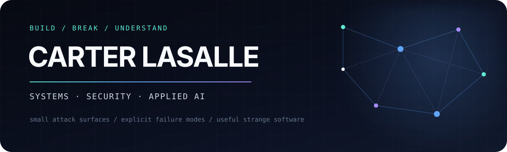

<p align="center">
  
</p>

<p align="center">
  <a href="https://carterlasalle.com"><strong>carterlasalle.com</strong></a>
  &nbsp;·&nbsp;
  Security Engineering at <a href="https://lila.ai"><strong>Lila Sciences</strong></a>
  &nbsp;·&nbsp;
  <a href="https://github.com/fl97inc"><strong>@fl97inc</strong></a>
</p>

I’m a computer science student at **Notre Dame ’29** who builds security-minded software close to real constraints: malformed packets, private messages, rolling-shutter cameras, terminal workflows, unreliable links, and human operators.

I care about small attack surfaces, explicit failure modes, and products that are as serious about tests and documentation as they are about the demo.

<table>
<tr>
<td width="50%" valign="top">

### [Mac Messages MCP](https://github.com/carterlasalle/mac_messages_mcp)

**44,000+ downloads.** A local-first Model Context Protocol server for reading, searching, and sending through macOS Messages.

Message data stays on-device, databases open read-only, and attachments use deliberate progressive disclosure.

`Python` `MCP` `SQLite` `macOS` · [PyPI](https://pypi.org/project/mac-messages-mcp/)

</td>
<td width="50%" valign="top">

### [VEIL](https://github.com/carterlasalle/veil)

A safety-gated research and control stack for studying high-frequency stage-light modulation against rolling-shutter cameras.

It spans simulation, signed edge schedules, fail-closed controls, an operator console, portable firmware, audit chains, and a 120-case device matrix.

`Python` `C11` `TypeScript` `FastAPI` `Ed25519`

</td>
</tr>
<tr>
<td width="50%" valign="top">

### [NetSift](https://github.com/carterlasalle/NetSift)

A dependency-free packet-capture explorer that turns PCAP and PCAPNG files into answers from the terminal.

Defensive protocol decoding, deterministic structured output, a compact filter language, randomized robustness tests, and cross-platform CI.

`Python` `Networking` `PCAP` `TLS` `DNS`

</td>
<td width="50%" valign="top">

### [treecat](https://github.com/carterlasalle/treecat)

A polished Go CLI and interactive TUI for turning a codebase into useful, syntax-highlighted context.

Distributed through Homebrew and native packages, with automated releases for macOS, Linux, and Windows.

`Go` `TUI` `Homebrew` `GoReleaser`

</td>
</tr>
<tr>
<td width="50%" valign="top">

### [PixelChangeCheck](https://github.com/carterlasalle/PixelChangeCheck)

A Rust screen-sharing system that transmits changed regions instead of blindly resending frames.

Includes direct QUIC transport, relay-backed NAT traversal, adaptive quality, a native viewer, and zero-install browser viewing.

`Rust` `QUIC` `LZ4` `MJPEG` `Networking`

</td>
<td width="50%" valign="top">

### [Stamina Timer](https://github.com/carterlasalle/staminatimer)

A production training PWA with guided sessions, analytics, expiring shares, and an optional authenticated AI coach.

Authorization is enforced with PostgreSQL row-level security; server routes add origin, CSRF, size, and rate-limit controls.

`Next.js` `TypeScript` `Supabase` `PWA` · [Live](https://staminatimer.com)

</td>
</tr>
</table>

### The through-line

```text
untrusted input  ──▶  narrow boundary  ──▶  observable behavior  ──▶  safe failure
```

- **Local first when data is personal.** A tool should not need a cloud round-trip just because one is convenient.
- **Failures are product behavior.** Corrupt captures, expired signatures, missing sensors, and dropped connections deserve designed outcomes.
- **Shipping is part of engineering.** Reproducible installs, CI, tests, release automation, runbooks, and threat models are not cleanup work.

### Smaller, stranger experiments

[EmojiStega](https://github.com/carterlasalle/emojistega) hides data in Unicode variation selectors ·
[System Information MCP](https://github.com/carterlasalle/system_information_mcp) gives coding agents structured local environment context ·
[Conversation Predictor](https://github.com/carterlasalle/conversation-predictor) explores conversation paths with MCTS and language models ·
[Ghost Typer](https://github.com/carterlasalle/ghost-typer) studies realistic typing dynamics in a local browser extension

---

<p align="center">
  <sub>Currently exploring secure agent tooling, local-first integrations, network systems, and cyber-physical safety.</sub>
</p>
